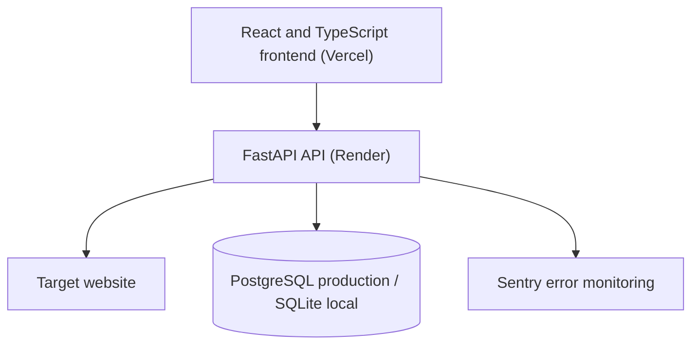

# Is It Down?

[](https://github.com/JerryX2007/isitdown/actions/workflows/ci.yml)


A production-deployed website availability checker built with React, TypeScript, FastAPI, and PostgreSQL. It performs fresh server-side availability checks, displays response details, and combines them with anonymous community outage reports.

**[Open the live application](https://isitdown-ivory.vercel.app/)** ·
**[View the API documentation](https://isitdown-api-zkdb.onrender.com/docs)** ·
**[Check API health](https://isitdown-api-zkdb.onrender.com/api/health)**

## Features

### Website monitoring

- Runs fresh HTTP and HTTPS availability checks from the FastAPI backend
- Displays website status, response time, HTTP status code, and check time
- Automatically normalizes inputs such as `github.com` and `https://github.com`
- Gives every website a shareable results page at `/status/example.com`
- Saves check results for later retrieval

### Community outage reporting

- Allows visitors to report outages without creating an account
- Displays outage-report history over 24-hour and 7-day ranges
- Hashes anonymous reporter identifiers before storing them
- Prevents the same browser from reporting the same website more than once per hour

### Security and reliability

- Rejects private, local, multicast, and non-public network addresses
- Restricts checks to HTTP and HTTPS
- Rejects custom ports and URLs containing login credentials
- Supports environment-based configuration
- Provides a production health endpoint
- Produces structured JSON request logs with request IDs and response durations
- Integrates with Sentry for production error monitoring
- Uses Alembic for repeatable database migrations
- Runs backend and frontend checks through GitHub Actions

## Architecture



The application presents two separate signals:

- **Live status** comes from a fresh request performed by the FastAPI backend.
- **Community history** comes from anonymous outage reports submitted by visitors.

A failed community report does not automatically mark a website as down, and a successful backend check does not prove the website is reachable from every location.

## Technology

| Layer | Technologies |
| --- | --- |
| Frontend | React 19, TypeScript 6, Vite 8, React Router |
| Backend | Python, FastAPI, HTTPX, Uvicorn |
| Database | PostgreSQL, SQLite, SQLAlchemy 2, Alembic |
| Testing | Pytest, Vitest, React Testing Library |
| Code quality | Ruff, Black, ESLint, TypeScript |
| Observability | Structured JSON logging, request IDs, Sentry |
| Deployment | Vercel, Render |
| CI | GitHub Actions |

## Project structure

```text
isitdown/
├── .github/
│   └── workflows/
│       └── ci.yml
├── backend/
│   ├── migrations/
│   │   ├── versions/
│   │   └── env.py
│   ├── routes/
│   │   └── monitors.py
│   ├── tests/
│   ├── .env.example
│   ├── alembic.ini
│   ├── config.py
│   ├── database.py
│   ├── database_models.py
│   ├── logging_config.py
│   ├── main.py
│   ├── models.py
│   ├── requirements.txt
│   └── requirements-dev.txt
├── frontend/
│   ├── src/
│   ├── .env.example
│   ├── package.json
│   ├── vercel.json
│   └── vite.config.ts
├── .gitignore
└── README.md
```

## Running locally

### Prerequisites

- Python 3.10 or newer
- Node.js 22
- npm
- Git

Clone the repository:

```bash
git clone https://github.com/JerryX2007/isitdown.git
cd isitdown
```

### 1. Start the backend

Open a terminal in the backend directory:

```powershell
cd backend
```

#### Windows PowerShell

Create and activate a virtual environment:

```powershell
py -m venv .venv
.\.venv\Scripts\Activate.ps1
```

If PowerShell blocks the activation script:

```powershell
Set-ExecutionPolicy -Scope Process -ExecutionPolicy RemoteSigned
.\.venv\Scripts\Activate.ps1
```

Install the dependencies:

```powershell
python -m pip install --upgrade pip
python -m pip install -r requirements.txt
```

Create your local environment file:

```powershell
Copy-Item .env.example .env
```

Apply the database migrations:

```powershell
python -m alembic upgrade head
```

Start FastAPI:

```powershell
python -m uvicorn main:app --reload
```

#### macOS or Linux

```bash
cd backend
python3 -m venv .venv
source .venv/bin/activate
python -m pip install --upgrade pip
python -m pip install -r requirements.txt
cp .env.example .env
python -m alembic upgrade head
python -m uvicorn main:app --reload
```

The local backend will be available at:

- API: http://127.0.0.1:8000
- Interactive documentation: http://127.0.0.1:8000/docs
- Health endpoint: http://127.0.0.1:8000/api/health

### 2. Start the frontend

Open a second terminal:

```powershell
cd frontend
npm install
npm run dev
```

Open http://localhost:5173 in your browser.

Both terminals must remain running while using the application locally.

## Environment variables

### Backend

Copy `backend/.env.example` to `backend/.env`.

| Variable | Purpose | Local default |
| --- | --- | --- |
| `APP_ENV` | Identifies the current environment | `development` |
| `DATABASE_URL` | SQLAlchemy database connection URL | `sqlite:///./monitor.db` |
| `FRONTEND_ORIGINS` | Comma-separated list of permitted frontend origins | Local Vite URLs |
| `LOG_LEVEL` | Application logging level | `INFO` |
| `SENTRY_DSN` | Optional Sentry project DSN | Empty |

Example:

```env
APP_ENV=development
DATABASE_URL=sqlite:///./monitor.db
FRONTEND_ORIGINS=http://localhost:5173,http://127.0.0.1:5173
LOG_LEVEL=INFO
SENTRY_DSN=
```

SQLite is used by default for local development. Production uses PostgreSQL through the same SQLAlchemy models.

### Frontend

Copy `frontend/.env.example` to `frontend/.env`.

```env
VITE_API_BASE=http://127.0.0.1:8000
```

Restart the Vite development server after changing this value.

## API reference

| Method | Endpoint | Purpose |
| --- | --- | --- |
| `GET` | `/api/health` | Confirm that the backend is running |
| `POST` | `/api/check` | Run and store an availability check |
| `GET` | `/api/status/{target}/history?range=24h` | Retrieve 24-hour outage history |
| `GET` | `/api/status/{target}/history?range=7d` | Retrieve 7-day outage history |
| `POST` | `/api/status/{target}/report` | Submit an anonymous outage report |

### Check a website

```http
POST /api/check
Content-Type: application/json
```

```json
{
  "website": "github.com",
  "timeout": 7
}
```

Example response:

```json
{
  "target": "github.com",
  "status": "up",
  "latency": 84.31,
  "status_code": 200,
  "checked_at": "2026-07-31T15:21:36Z",
  "error": null
}
```

### Submit an outage report

```http
POST /api/status/github.com/report
Content-Type: application/json
```

```json
{
  "reporter_id": "browser-generated-identifier"
}
```

The frontend generates and stores the anonymous identifier in local storage. The backend combines it with the target website and stores only its SHA-256 hash.

## Status meanings

| Status | Meaning |
| --- | --- |
| `up` | The website responded with an HTTP status below 500 |
| `issues` | The website responded with a server error in the 500 range |
| `down` | DNS failed, the request timed out, or a connection could not be made |

## Database and migrations

The application uses SQLAlchemy so the same models work with:

- SQLite during local development
- PostgreSQL in production

The database currently contains:

- `check_history`: availability results, latency, HTTP status, timestamps, and connection errors
- `outage_reports`: targets, hashed reporter identifiers, and report timestamps

Apply all migrations:

```bash
cd backend
python -m alembic upgrade head
```

After changing a database model, generate a migration:

```bash
python -m alembic revision --autogenerate -m "describe the change"
python -m alembic upgrade head
```

## Testing and code quality

### Backend

Install the development dependencies:

```bash
cd backend
python -m pip install -r requirements-dev.txt
```

Run the backend checks:

```bash
python -m black --check .
python -m ruff check .
python -m pytest
```

### Frontend

```bash
cd frontend
npm ci
npm run lint
npm run typecheck
npm test
npm run build
```

GitHub Actions runs these backend and frontend checks on pushes and pull requests.

## Observability

Every API request produces a structured JSON log containing fields such as:

- Timestamp
- Log level
- Environment
- Request ID
- HTTP method and path
- Response status
- Request duration

The API returns the request identifier in the `X-Request-ID` response header.

When `SENTRY_DSN` is configured, unexpected production errors are also reported to Sentry. Personally identifiable information and performance tracing are disabled by default.

## Deployment

The current production deployment uses:

- **Frontend:** [Vercel](https://isitdown-ivory.vercel.app/)
- **Backend:** [Render](https://isitdown-api-zkdb.onrender.com)
- **Database:** Hosted PostgreSQL

Production configuration requires:

1. `VITE_API_BASE` set to the deployed backend URL
2. `DATABASE_URL` set to the hosted PostgreSQL connection string
3. `FRONTEND_ORIGINS` set to the deployed frontend URL
4. `APP_ENV` set to `production`
5. `SENTRY_DSN` set when error monitoring is enabled
6. `alembic upgrade head` run before the updated API starts

The frontend’s `vercel.json` configures an SPA rewrite so direct links such as `/status/github.com` load correctly.

## Limitations

- Checks run from the backend server, not the visitor’s device. Regional, account-specific, DNS, or local-network problems may produce different results.
- Community reports are user-submitted and do not prove that a website is unavailable for everyone.
- Anonymous identifier hashing and hourly duplicate protection reduce repeated reports but are not a complete anti-spam system.
- A website may block automated requests even when it is available to normal browsers.

## Roadmap

- Scheduled recurring checks with a background worker
- Automated incident detection and recovery tracking
- Public monitors for frequently checked websites
- Notification support for detected outages
- Server-side rate limiting for public API operations
- Caching for frequently requested status pages
