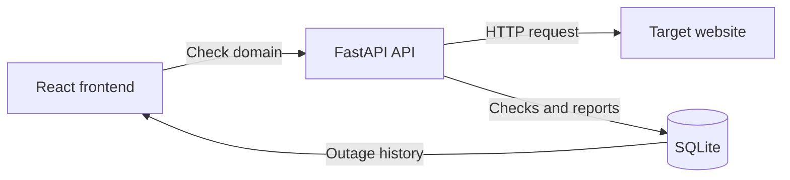

# Is My Website Down?


A full-stack website availability checker built with React, TypeScript,
FastAPI, and SQLite. Enter a domain to run a fresh availability check, view
community outage reports from the previous 24 hours or 7 days, and report an
issue without creating an account.

## Features

- Checks public HTTP and HTTPS websites
- Automatically normalizes domains such as `github.com` and
  `https://github.com`
- Displays the current status, response time, and HTTP status code
- Gives every website its own results page at `/status/example.com`
- Visualizes community outage reports over 24-hour and 7-day ranges
- Allows anonymous outage reporting without a user system
- Limits each browser to one report per website per hour
- Stores checks and reports persistently in SQLite
- Rejects private and local network addresses
- Includes responsive layouts for desktop and mobile

## How it works



The live status and the community report graph are separate signals:

- **Live status** is based on a fresh request made by the FastAPI backend.
- **Community history** is based on reports submitted by visitors.

## Technology

| Layer | Technologies |
| --- | --- |
| Frontend | React 19, TypeScript, Vite, React Router |
| Backend | Python, FastAPI, HTTPX, Uvicorn |
| Database | SQLite |
| Styling | Responsive CSS |

## Project structure

```text
networkstatusmonitor/
├── backend/
│   ├── routes/
│   │   ├── __init__.py
│   │   └── monitors.py
│   ├── database.py
│   ├── main.py
│   ├── models.py
│   └── requirements.txt
├── frontend/
│   ├── src/
│   │   ├── App.css
│   │   ├── App.tsx
│   │   ├── index.css
│   │   └── main.tsx
│   ├── .env.example
│   ├── index.html
│   ├── package.json
│   └── vite.config.ts
├── .gitignore
└── README.md
```

## Getting started

### Prerequisites

- Python 3.10 or newer
- Node.js 20.19+ or 22.12+
- npm

Clone the repository:

```bash
git clone <your-repository-url>
cd networkstatusmonitor
```

### 1. Start the backend

Open a terminal in the backend directory:

```powershell
cd backend
```

#### Windows PowerShell

Create and activate a virtual environment:

```powershell
py -m venv .venv
.\.venv\Scripts\Activate.ps1
```

If PowerShell blocks the activation script, allow it for the current terminal:

```powershell
Set-ExecutionPolicy -Scope Process -ExecutionPolicy RemoteSigned
.\.venv\Scripts\Activate.ps1
```

Install the backend dependencies and start FastAPI:

```powershell
python -m pip install --upgrade pip
python -m pip install -r requirements.txt
python -m uvicorn main:app --reload
```

#### macOS or Linux

```bash
cd backend
python3 -m venv .venv
source .venv/bin/activate
python -m pip install --upgrade pip
python -m pip install -r requirements.txt
python -m uvicorn main:app --reload
```

The backend will run at:

```text
http://127.0.0.1:8000
```

Interactive API documentation is available at:

```text
http://127.0.0.1:8000/docs
```

SQLite creates `backend/monitor.db` automatically when the API starts.

### 2. Start the frontend

Open a second terminal:

```powershell
cd frontend
npm install
npm run dev
```

Open the frontend at:

```text
http://localhost:5173
```

Both terminals must remain running while using the application.

## Environment variables

### Frontend API address

The frontend uses `http://127.0.0.1:8000` by default. To use another backend
address, copy `.env.example` to `.env` inside `frontend`:

```env
VITE_API_BASE=http://127.0.0.1:8000
```

Restart `npm run dev` after changing an environment variable.

### Allowed frontend origins

FastAPI permits the local Vite addresses by default. For a different frontend
domain, set `FRONTEND_ORIGINS` before starting the backend.

Windows PowerShell:

```powershell
$env:FRONTEND_ORIGINS="http://localhost:5173,https://your-frontend.com"
python -m uvicorn main:app --reload
```

macOS or Linux:

```bash
export FRONTEND_ORIGINS="http://localhost:5173,https://your-frontend.com"
python -m uvicorn main:app --reload
```

## API reference

| Method | Endpoint | Purpose |
| --- | --- | --- |
| `GET` | `/api/health` | Confirm that the backend is running |
| `POST` | `/api/check` | Run and save a website availability check |
| `GET` | `/api/status/{target}/history?range=24h` | Retrieve the 24-hour report graph |
| `GET` | `/api/status/{target}/history?range=7d` | Retrieve the 7-day report graph |
| `POST` | `/api/status/{target}/report` | Submit an anonymous outage report |

### Check a website

Request:

```http
POST /api/check
Content-Type: application/json
```

```json
{
  "website": "github.com",
  "timeout": 7
}
```

Example response:

```json
{
  "target": "github.com",
  "status": "up",
  "latency": 84.31,
  "status_code": 200,
  "checked_at": "2026-07-25T01:00:00Z",
  "error": null
}
```

### Submit an outage report

Request:

```http
POST /api/status/github.com/report
Content-Type: application/json
```

```json
{
  "reporter_id": "browser-generated-identifier"
}
```

The frontend generates and stores this anonymous identifier in local storage.
The backend stores only its SHA-256 hash.

## Status meanings

| Status | Meaning |
| --- | --- |
| `up` | The website responded with an HTTP status below 500 |
| `issues` | The website responded with a server error in the 500 range |
| `down` | DNS failed, the request timed out, or no connection could be made |

## Database

The SQLite database contains two main tables:

- `check_history`: stores the target, status, response time, HTTP status code,
  timestamp, and any connection error.
- `outage_reports`: stores the target, hashed reporter identifier, and report
  timestamp.

Delete `backend/monitor.db` while the server is stopped if you want to reset all
local history.

## Production notes

Build the frontend:

```bash
cd frontend
npm run build
```

The production files will be generated in `frontend/dist`.

Before deploying:

1. Set `VITE_API_BASE` to the deployed backend URL.
2. Add the deployed frontend URL to `FRONTEND_ORIGINS`.
3. Configure the frontend host to serve `index.html` for unknown routes such as
   `/status/github.com`. This is commonly called an SPA fallback or rewrite.
4. Replace SQLite with a hosted database if the backend will run on multiple
   server instances.

## Limitations

- Availability is checked from the backend server, not directly from the
  visitor's device. A visitor may still have a local DNS, network, regional, or
  account-specific issue.
- Community reports are user-submitted and do not prove that a website is
  unavailable for everyone.
- Browser-based report limiting reduces accidental duplicate reports but is not
  a complete anti-spam system.
- SQLite is suitable for local development and a single backend instance.

## Troubleshooting

### `pip.exe` cannot find the Python executable

Virtual environments contain absolute paths and can break when a project is
moved or renamed. Recreate the environment from `backend`:

```powershell
deactivate
Remove-Item -Recurse -Force .venv
py -m venv .venv
.\.venv\Scripts\Activate.ps1
python -m pip install -r requirements.txt
```

### The frontend cannot reach the backend

Confirm that:

- FastAPI is running on `http://127.0.0.1:8000`.
- Vite is running on `http://localhost:5173`.
- `VITE_API_BASE` contains the correct backend address.
- The frontend origin is included in `FRONTEND_ORIGINS`.

### A status-page URL returns 404 after deployment

Enable an SPA fallback that rewrites unknown frontend routes to `index.html`.

### npm reports security vulnerabilities

Review the report with:

```bash
npm audit
```

You may try `npm audit fix`. Avoid `npm audit fix --force` unless you have
reviewed the breaking dependency changes.

## Possible next improvements

- Add scheduled background checks and automated incident detection
- Add server-side rate limiting for outage reports
- Add automated backend and frontend tests
- Cache popular website checks
- Replace SQLite with PostgreSQL for multi-instance deployment
- Add a public status summary for frequently checked websites
